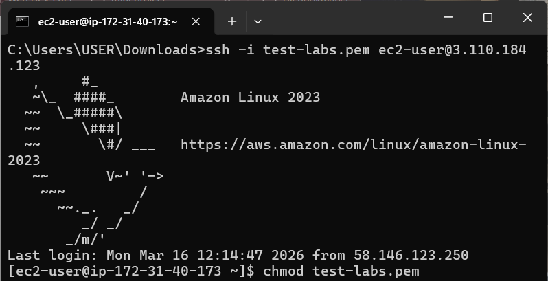

# EC2 - Amazon Elastic Compute Cloud

**Date Studied:** 16-03-2026  
**Week:** 1  |  **Day:** 1  |  **Status:** ✅ Complete

---

## What Is It?
EC2 allows you to run virtual servers in the cloud to host applications.

## How It Works (Key Concepts)
- EC2 Instance: A virtual machine in AWS.
- AMI: Template used to launch instances.
- Instance Type: Defines CPU, memory, and performance (e.g., t3.micro).
- Key Pair: Used for secure SSH login.
- Security Group: Firewall controlling traffic to the instance.
- Public IP: Address used to access the instance over the internet.

## What I Built Today (Hands-On)
- Navigated to EC2 service via AWS Console
- Launched EC2 instance:
  - Name: Test Server
  - AMI: Amazon Linux 2023
  - Instance Type: t3.micro
  - Default settings used
- Created key pair and downloaded `.pem` file
- Connected to EC2 instance using SSH via Windows CMD
- Installed Apache web server (`httpd`)
- Started and enabled the Apache service
- Modified security group:
  - Allowed inbound HTTP (port 80)
- Edited `/var/www/html/index.html` with a custom message
- Verified server by accessing public IP in browser

## Commands Used
```bash
ssh -i your-key.pem ec2-user@your-public-ip
# Connect to EC2 instance

sudo yum update -y
# Update system packages

sudo yum install httpd -y
# Install Apache web server

sudo systemctl start httpd
# Start Apache service

sudo systemctl enable httpd
# Enable Apache on boot

sudo nano /var/www/html/index.html
# Edit web page content
```


