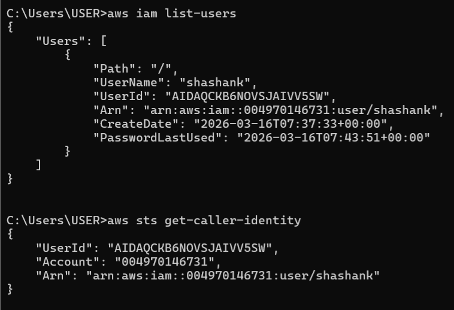

# IAM - AWS Identity and Access Managemnet

**Date Studied:** 16-03-2026
**Week:** 1 | **Day** 1 | **Status** Complete

---

## What Is It ?
IAM controls who can access AWS and what actions they are allowed to perform 

## How It Works (Key Concepts)
- IAM Users: Individual identities created for access to AWS.
- IAM Groups: Logical grouping of users with shared permissions.
- Policies: JSON-based rules that define permissions.
- Roles: Temporary access permissions for services or users.
- Root Account: Has full access - should not be used daily.
- MFA: Adds an extra layer of security.
- Access Keys: Used for CLI and programmatic access.

## What I Built Today (Hands-On)
- Created AWS Free Tier account
- Enabled MFA on root account
- Created IAM user `admin-user`
- Created group `Admins`
- Attached `AdministratorAccess` policy to `Admins` group
- Logged out of root account
- Logged in using IAM user password
- Changed IAM user password
- Generated access keys for CLI usage
- Installed AWS CLI on Windows
- Configured CLI using `aws-configure`
- Verified setup using:
	- `aws sts get-caller-identity`
	- `aws iam list-users`



## Commands Used
```bash
aws configure
# Configure AWS CLI with credentials

aws sts get-caller-identity
# Check which IAM identity is active

aws iam list-users
# List all IAM users

