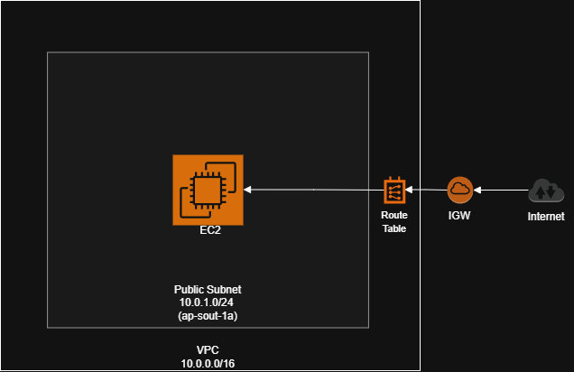

# VPC - Amazon Virtual Private Cloud 

**Date Studied:** 18 March 2026
**Week:** 1 | **Day:** 3 | **Status:**  Complete

---

## What Is It?
VPC is a private network in AWS where you can launch and control ypur resources securely.

## How It Works (Key Concepts)
- VPC: A logically isolated network in AWS.
- CIDR Block: Defines the IP range for the VPC.
- Subnet: A smaller network inside a VPC.
- Availability Zone: Physical data center location for high availability.
- Internet Gateway (IGW): Enables internet access for resources in a VPC.
- Route Table: Controls where network traffic is directed.
- Public Subnet: Subnet with a route to the Internet Gateway.
- Security Group: Firewall controlling inbound and outbound traffic for instances.
- Public IP: Required for EC2 to communicate over the internet.
- Auto-assign IP: Automatically assigns a public IP to instances in a subnet.


## What I Built Today (Hands-On)
- Created a custom VPC named `week1-vpc` with CIDR `10.0.0.0/16`.
- Created a public subnet `public-subnet-1a` with CIDR `10.0.1.0/24` in AZ `ap-south-1a`.
- Enabled auto-assign public IPv4 for the subnet.
- Created an Internet Gateway `week1-igw` and attached it to the VPC.
- Created a route table and added route `0.0.0.0/0 -> week1-igw`.
- Associated the route table with `public-subnet-1a`.
- Created a security group `week1-web-sg`:
	- Allowed SSH (port 22) from my IP.
	- Allowed HTTP (port 80) from anywhere.
- Launched an EC2 instance (t2.micro) inside the VPC and subnet.
- Connected to EC2 via SSH.
- Installed Appache web server and served a custom HTML page.
- Verified website loads using the EC2 public IP.
- Performed failure test:
	- Deleted route `0.0.0.0/0` -> lost SSH and HTTP access.
	- Re-added route -> connectivity restored.
- Stopped EC2 instance after testing.

## Commands Used 
```bash
ssh -i cloud-labs.pem ec2-user@<public-ip>
# Connect to EC2 instance

sudo yum update -y
# Update packages

sudo yum install httpd -y
# Install Apache web server

sudo systemctl start httpd
# Start Apache service

suo systemctl enable httpd
# Enable Apache on boot

echo "<h1>My VPC Web Server</h1> | sudo tee /var/www/html/index.html"
# Create a simple HTML page
```

## What Broke / What Confused Me
Deleting the 0.0.0.0/0 route immediately broke both SSH and HTTP access, which clarified that Internet Gateway alone is not enough, route table configuration is critical for connectivity

## One-Line Summary
VPC is a private, customisable network in AWS used to securely run and control cloud resources.
