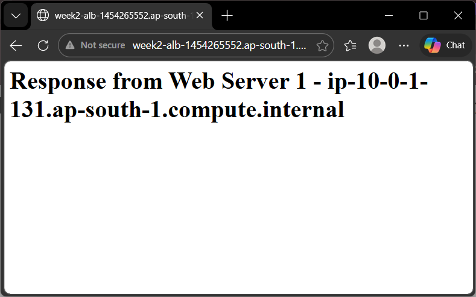
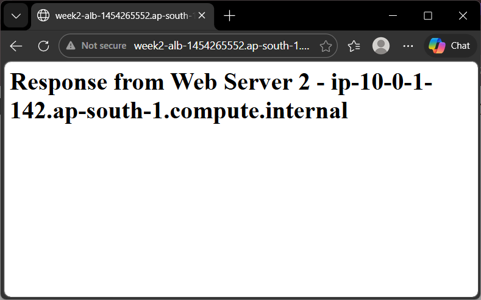
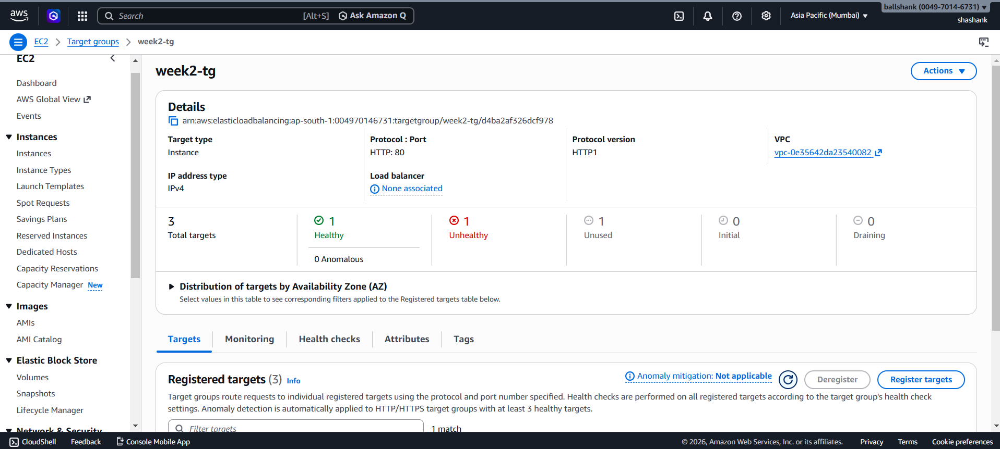

# Elastic Load Balancing - Application Load Balancer

**Date Studied:** 24 March 2026
**Week:** 2 | **Day:** 2 | **Status:** Complete

---

## What Is It?
Application Load Balancer distributes incoming web traffic across multiple servers, so your app stays available and scalable.

## How It Works (Key Concepts)
- ALB: Layer 7 load balancer that routes HTTP/HTTPS traffic.
- Target Group: Logical group of EC2 instances receiving traffic.
- Listener: Checks for incoming requests (e.g., HTTP 80) and forwards them.
- Health Check: Periodically verifies if targets are healthy.
- Security Group (ALB): Allows inbound traffic from the internet.
- Security Group (EC2): Allows traffic only from ALB.
- Internet-Facing: ALB accessible from the public internet.
- Multi-AZ: Requires at least 2 subnets in different Availability Zones.
- Round Robin: Default method to distribute traffic across targets.
- Failover: Automatically routes traffic away from unhealthy instances.

## What I Built Today (Hands-On)
- Created security group `alb-sg`:
	- Allowed HTTP (80) and HTTPS (443) from anywhere.
- Created security group `web-sg`:
	- Allowed HTTP (80) only from `alb-sg`.
- Launched two EC2 instances:
	- `web-server-1` and `web-server-2`.
	- Used EC2 User Data to install Apache automatically.
	- Configured each to serve different HTML content.
- Created target group `week2-tg`:
	- Protocol: HTTP, Port: 80.
	- Health check path: `/`.
- Created Application Load Balancer `week2-alb`:
	- Internet-facing.
	- Attached to two public subnets in different AZs (`ap-south-1a`, `ap-south-1b`)...
	- Associated with `alb-sg`.
	- Listener: HTTP 80 > forwards to `week2-tg`.
- Registered both EC2 instances in the target group.
- Verified that both targets are healthy.
- Accessed ALB DNS: 
	- Observed traffic alternating between both servers.
	
	
- Performed health check experiment 
	- Stopped `web-server-1`.
	- Target marked unhealthy after ~20 seconds.
	
	- ALB routed all traffic to `web-server-2`.
	
	- Restarted `web-server-1`.
	- Target marked healthy after ~30 seconds.
	- Traffic resumed load balancing across both servers.

## Commands Used 
```bash 
# User Data script (used during EC2 launch)
#!/bin/bash
yum update -y
yum install httpd -y
systemctl start httpd
systemctl enable httpd
echo "<h1>Web Server 1</h1>" | sudo tee /var/www/html/index.html
```

## What Broke / What Confused Me 
ALB requires at least two subnets in different Availability Zones.
Initially, I had only one subnet, so ALB creation was not possible.
After adding another subnet in a different AZ, ALB creation succeeded. 
This ensures high availability across AZs.

## One-Line Summary 
Application Load Balancer distributes web traffic across multiple servers and ensures high availability using multi-AZ architecture and health checks.


