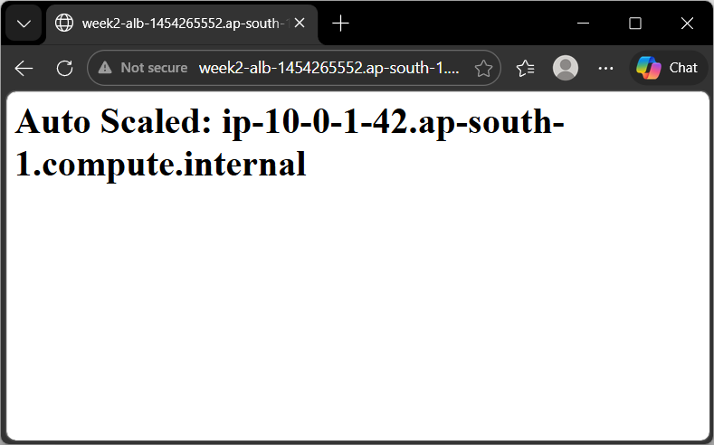
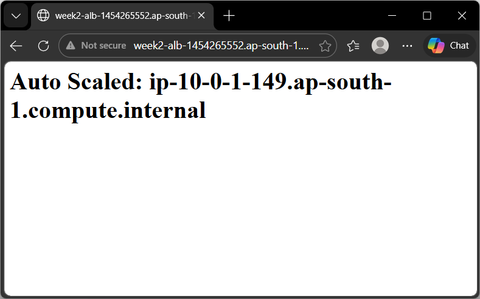

# Auto Scaling Groups - Launch Templates + Scaling Policies + CloudWatch

**Date Studied:** 25 March 2026
**Week:** 2 | **Day:** 3 | **Status:** Complete

---

## What Is It?
Auto Scaling automatically adds or removes EC2 instances based on demand, so your application stays available and cost-efficient.

## How It Works (Key Concepts)
- Launch Template: Blueprint for EC2 instances (AMI, instance type, SG, user data).
- Auto Scaling Group (ASG): Manages a group of EC2 instances.
- Desired Capacity: Number of instances ASG tries to maintain.
- Min/Max Size: Lower and upper limits for scaling.
- Target Group: Connects ASG instances to Load Balancer.
- Health Checks: Replaces unhealthy instances automatically.
- Scaling Policy: Defines when to scale in/out.
- Target Tracking: Keeps a metric (e.g., CPU) at a defined level.
- CloudWatch: Monitors metrics and triggers alarms.
- SNS: Sends notifications based on alarms.

## What I Built Today (Hands-On)
- Created launch template `week1-lt`:
	- AMI: Amazon Linux 2023
	- Instance: t3.micro
	- Security group: `web-sg`
	- User data: installs Apache automatically
- Created Auto Scaling Group `week2-asg`:
	- Desired: 2, Min: 1, Max: 4
	- Attached to target group `week2-tg` (behind ALB)
- Observed ASG automatically launch 2 EC2 instances.
- Verified both instances are healthy in the target group.
- Accessed ALB DNS and confirmed traffic served from ASG instances.
- Performed manual scaling:
	- Increased desired capacity to 3 > new instance launched automatically.
		- 
		- 
		- 
	- Decreased desired capacity to 1 > extra instances terminated automatically.
 		- 
- Configured scaling policy:
	- Target tracking policy with CPU target = 50%.
- Created SNS topic `week2-alerts`:
	- Subscribed to the email and confirmed the subscription.
- Created CloudWatch alarm:
	- Trigger: CPU > 70% from 2 minutes.
	- Action: Send notification via SNS.
- Restored desired capacity to 2 > verified 2 healthy instances.
- Set desired/min/max to 0 > all instances terminated to avoid cost.

## Commands Used
```bash
# No major CLI commands used - setup was primarily via AWS Console
```

## What Broke / What Confused Me
Nothing broke - but I want to remember: ASG takes time (1-3 minutes) to launch or terminate instances, so scaling actions are not instant and require patience during testing.

## One-Line Summary
Auto Scaling Groups automatically manage EC2 capacity using launch templates, scaling policies, and CloudWatch metrics to ensure performance and cost efficiency.

